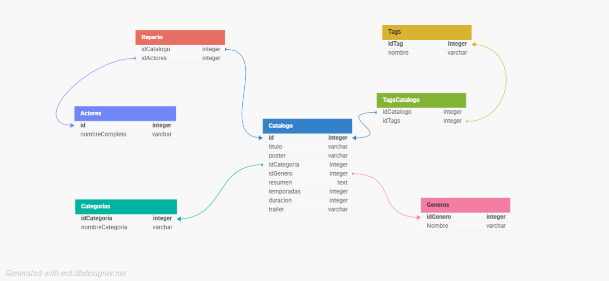

# 🎬 API de TrailerFlix

Una API RESTful desarrollada con **Node.js**, **Express**, **Sequelize** y **MySQL**, que permite consultar, filtrar y gestionar un catálogo de películas y series, junto con su información de géneros, categorías, actores y tags. Ideal para prácticas backend o sistemas audiovisuales.

---

## 🚀 Tecnologías utilizadas

- [Node.js](https://nodejs.org/) – entorno de ejecución JavaScript
- [Express](https://expressjs.com/) – framework web para Node
- [Sequelize](https://sequelize.org/) – ORM para bases de datos relacionales
- [MySQL](https://www.mysql.com/) – motor de base de datos
- [dotenv](https://www.npmjs.com/package/dotenv) – gestión de variables de entorno
- [Postman](https://www.postman.com/) – herramienta para testear APIs

---

## 🚀 Diagrama de Base de Datos



## 📁 Estructura del proyecto


```
TrailerFlix-db/
├── src/
│   ├── models/             # Modelo Sequelize 
│   ├── routes/
│   │   ├── controllers/    # Rutas CRUD 
│   │   └── index.js        # Enrutador principal
│   ├── database.js         # Conexión a MySQL con Sequelize
│   └── app.js              # Servidor Express
├── .env                    # Variables de entorno (no subir a GitHub)
├── package.json            # Dependencias del proyecto
└── README.md               # Documentación
```

## ⚙️ Configuración inicial

1. Cloná este repositorio  
2. Asegurate de tener **MySQL corriendo** y haber creado la base `trailerflix` con la tablas necesarias.
3. Crear un archivo `.env` en la raíz del proyecto con tus datos de conexión:

```env
DB_NAME=trailerflix
DB_USER=root
DB_PASS=tu_contraseña
DB_HOST=localhost
DB_DIALECT=mysql
PORT=3006
```

4. Instalá las dependencias:

```bash
npm install
```

5. Iniciá el servidor:

```bash
node src/app.js
```

---

## 📖 Endpoints disponibles

| Método | Ruta                | Descripción                     |
|--------|-------------------  |---------------------------------|
| GET    | `/catalogo`         | Trae todas las peliculas        |
| GET    | `/catalogo/genero`  | Filtra por nombre de género usando las query params         |
| GET   | `/catalogo/genero/:id`| Filtra por IDs de género              |
| GET    | `/catalogo/resumen`       | Filtra por palabra clave en el resumen. Por ej: Misión   |
| GET | `/catalogo/tagsCombinados`       | Trae las peliculas cuyos tags sean "Aventura" y "Ciencia Ficción", o "Aventura" y "Fantasía".  |
| GET    | `/catalogo/series3temporadas`       | Lista series con al menos 3 temporadas    |
| GET | `/actor/chris-pratt/trabajos`       | Muestra la cantidad de películas/series que hizo Chris Pratt  |
| GET | `/catalogo/catalogo/totalSeries-peliculas/:id`       | Muestra la cantidad de series o peliculas registrada en el catálogo  |
| GET | `/catalogo/seriesByTemporadas`       | Muestra las series en orden descendente por cantidad de temporadas  |
| GET | `/catalogo/palabraClave/:palabraClave`      | Muestra películas por palabra clave en título o descripción  |
| PUT | `/catalogo/fechaLanzamiento`       | Modifica la fecha de lanzamiento del género Aventura|
---

## 🧪 Ejemplo de `GET /catalogo/genero`

*REQUEST*
```
GET /catalogo/genero?genero=Acción,Suspenso
```

*RESPONSE*
```json
[
  {
    "id": 18,
    "titulo": "Ava",
    "Genero": {
      "Nombre": "Acción"
    }
  },
  {
    "id": 7,
    "titulo": "Guasón",
    "Genero": {
      "Nombre": "Suspenso"
    }
  },
  ...
]

```


##  Realizado por:

- Razuc Milagros
- Ozuna Rebeca
- 